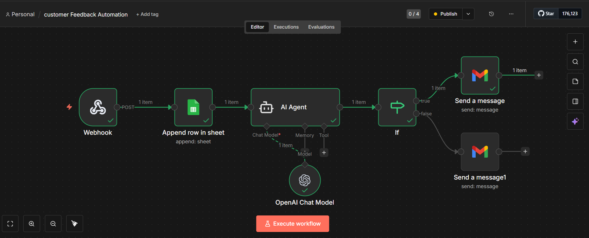
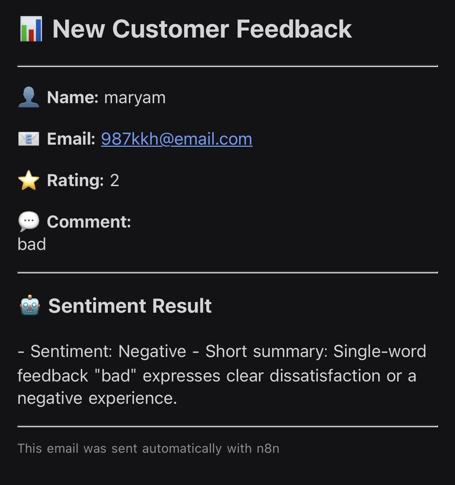

# 📊 Customer Feedback Automation

Automated customer feedback analysis and email alert system built with n8n and OpenAI.

---

## 🚀 Overview

This workflow automatically processes customer feedback, analyzes sentiment using AI, and sends email alerts based on the feedback rating.

It helps businesses quickly identify negative customer experiences and respond faster.

---

## ✨ Key Features

- 🔹 Automated feedback intake via Webhook  
- 🔹 AI-powered sentiment analysis  
- 🔹 Smart conditional logic using IF node  
- 🔹 Automatic email notifications  
- 🔹 Clean and structured email formatting  
- 🔹 Scalable for different business use cases  

---

## 🧠 How It Works

1. Customer submits feedback  
2. Webhook receives the data  
3. OpenAI analyzes sentiment  
4. IF node checks rating threshold  
5. System sends:
   - 🚨 Alert email for low ratings  
   - ✅ Normal email for positive feedback  

---

## 🛠️ Tech Stack

- **n8n** – workflow automation  
- **OpenAI** – sentiment analysis  
- **Gmail Node** – email notifications  
- **Webhook** – data intake  

---

## 📸 Workflow Preview

## 📧 Email Output Example

---

## 🎯 Use Cases

- Customer experience monitoring  
- Service quality alerts  
- Support team notifications  
- Business feedback automation  

---

## 👩🏻‍💻 Author

**Chaima Data Analytics**

---

## 📌 Notes

This project is designed as a scalable automation template that can be adapted for various industries.

أو نضيف badges ونجوم احترافية ⭐
قولي لي… ونفجره مستوى أعلى 😏🚀
